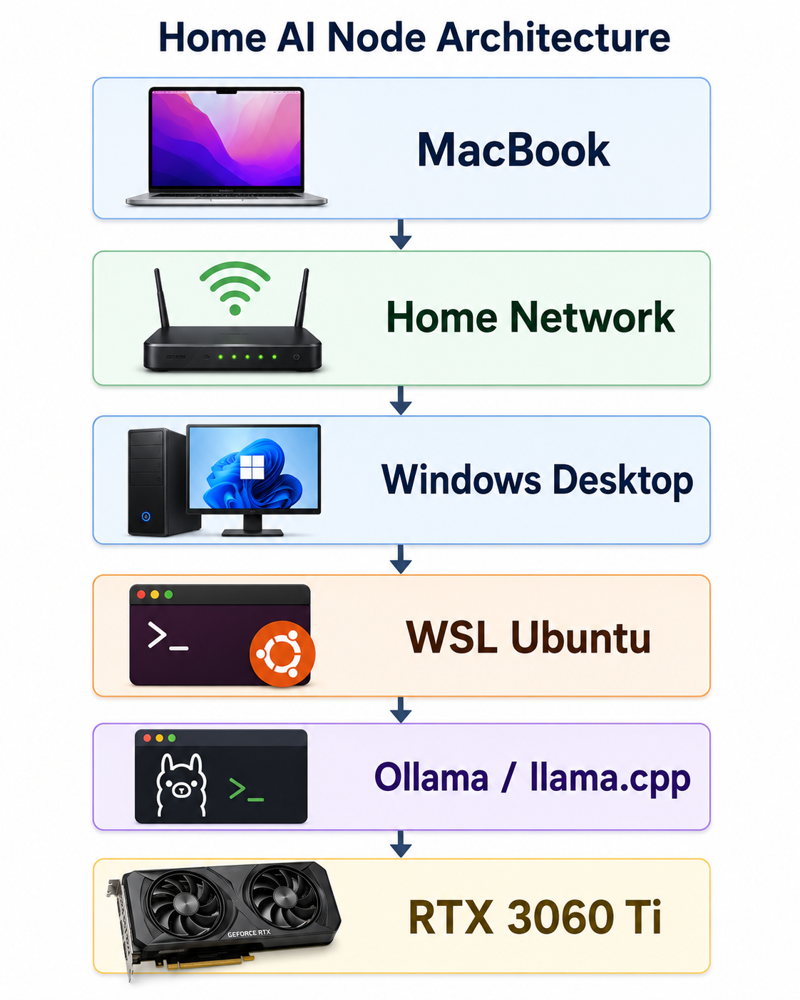

I started this project with a simple goal: a local AI node at home that I could treat like infrastructure, not a demo.

Not `ollama run` in a terminal I'd close. Something persistent. Something my MacBook could reach over the LAN while my desktop's GPU did the heavy lifting. Something I could eventually run eval scripts against, compare models on, and build research workflows on top of.

The target was:

<figure class="diagram-sm">



<figcaption>Generated with ChatGPT</figcaption>
</figure>

The reality was less clean. Getting from "installed" to "actually behaves like infrastructure" involved WSL networking modes, Windows Firewall profiles, multiple Windows identities, Docker volume semantics, and a genuinely confusing bug that made it look like I'd lost all my data when I hadn't.

This post covers the infrastructure layer: the problems and fixes that made it work. Part 2 covers adding llama.cpp as a second runtime and what that unlocks for research use.

One note on how this was actually built. I didn't follow a sequence of blog posts. I used an AI assistant to guide me through the setup, the way most people building this stack in 2026 will. That changes what this post is for. The hardest problems I hit weren't ones the AI could have warned me about, because they weren't documented anywhere in a form the model had seen. Writing them down now is partly a field report for humans and partly a small contribution to the corpus the next person's AI assistant will be pulling from. The dual-Windows-account bug below is the clearest example of that.

A note on extractability. My setup is a Windows desktop with a MacBook as the client, but the body of this post uses "client" generically. If you're building the same node and accessing it from a Windows laptop, a Linux box, or another desktop on your LAN, the debugging steps apply identically. If you're going single-machine (AI node and client are the same Windows PC), you can skip the LAN sections (network profile, firewall, mirrored networking) and pick up at the dual-identity WSL trap, which is universal.

---

## The hardware

- Windows desktop, NVIDIA RTX 3060 Ti (8GB VRAM)
- WSL2 running Ubuntu
- Ollama for convenient model serving
- Docker Engine (inside WSL, not Docker Desktop)
- OpenWebUI for a browser-based chat interface
- MacBook as the client / dev machine

The 3060 Ti handles quantized inference on 7B models comfortably and 13B models at aggressive quantization, and supports QLoRA fine-tuning on 7B models with tools like [Unsloth](https://unsloth.ai). Not unlimited, but a capable research workstation for the models that matter most right now.

The architecture goal:

```
MacBook             = client / dev machine
Windows desktop     = GPU-backed AI node
WSL Ubuntu          = Linux runtime layer
```

The node isn't meant to replace cloud GPUs for everything. It's a controlled local environment for inference experiments, model comparison, evaluation runs, and research workflows I want to control end to end.

---

## Why WSL instead of native Windows

Most AI infrastructure tooling is still more natural on Linux. WSL gives Linux package management, systemd, CUDA access from user space, Docker Engine, and a cleaner environment for llama.cpp, Python tooling, and eval scripts.

In practice, WSL turns the Windows desktop into a Linux workstation with GPU access, while the host stays Windows.

The important thing to understand: **WSL is not just "Linux on Windows."** It has its own networking behavior, filesystem boundaries, service lifecycle, and user-context traps. Those details matter a lot once you want the machine to behave like a server.

---

## Getting Ollama running

Inside WSL, installation is one line:

```bash
curl -fsSL https://ollama.com/install.sh | sh
```

Pull a model and run a quick local test:

```bash
ollama pull llama3
curl http://localhost:11434/api/tags
```

If that returns JSON, Ollama is alive locally. But local isn't enough. The real goal is client → Windows → WSL → Ollama, which means Ollama needs to bind to all interfaces, not just localhost.

---

## Making Ollama persistent with systemd

A systemd service override handles both persistence and the bind address:

```ini
[Service]
Environment="OLLAMA_HOST=0.0.0.0:11434"
Environment="OLLAMA_MODELS=/var/lib/ollama/models"
```

After reloading:

```bash
sudo systemctl daemon-reload
sudo systemctl enable ollama
sudo systemctl restart ollama
ss -tlnp | grep 11434
```

The bind check should show `*:11434` or `0.0.0.0:11434`. If it shows only `127.0.0.1:11434`, the client can't reach it. This single detail, localhost vs. 0.0.0.0, is an easy point where "works on my machine" breaks as a LAN service.

---

## Bug 1: Windows thought my home network was public

Before Ollama even mattered, basic LAN connectivity failed.

The client couldn't reliably reach the Windows host. Turning off the third-party firewall changed the behavior from "unreachable" to "timeout", which was a useful clue that the route existed but traffic was still being blocked somewhere.

The problem was the Windows network profile. PowerShell showed the Wi-Fi network as **Public**, which triggers stricter firewall rules:

```powershell
Get-NetConnectionProfile
Set-NetConnectionProfile -InterfaceAlias "Wi-Fi" -NetworkCategory Private
Enable-NetFirewallRule -Name FPS-ICMP4-ERQ-In
```

After that, the client could ping the Windows host. That was the first real milestone. Before debugging Ollama, Docker, or WSL, the basic host-to-host LAN path has to be trusted.

---

## Bug 2: Getting LAN access through WSL

WSL networking can be confusing because there are two valid ways to expose a Linux service to the outside world, and they work differently enough that running both at once causes problems.

**The portproxy approach** is explicit and debuggable. You tell Windows to forward a LAN port to WSL's internal IP:

```powershell
netsh interface portproxy add v4tov4 `
  listenaddress=0.0.0.0 `
  listenport=11434 `
  connectaddress=<WSL_IP> `
  connectport=11434
```

This works, but WSL's internal IP changes on restart, so the rules go stale. It also requires a rule per port, per service.

**The mirrored networking approach** is cleaner. WSL participates directly in the host network: services bind to `0.0.0.0` inside WSL and become reachable through the Windows host IP without any forwarding rules. It requires a recent WSL release (mirrored mode was introduced in WSL 2.0, see [Microsoft's WSL networking docs](https://learn.microsoft.com/en-us/windows/wsl/networking)). It's configured in `C:\Users\<user>\.wslconfig`:

```ini
[wsl2]
networkingMode=mirrored
dnsTunneling=true
autoProxy=true
firewall=true
```

With this in place, services inside WSL are reachable through the Windows host IP directly:

```
http://192.168.1.201:11434  # Ollama
http://192.168.1.201:3000   # OpenWebUI
http://192.168.1.201:8080   # llama.cpp (Part 2)
```

I had mirrored networking configured from an earlier setup. The problem was that I also had leftover `portproxy` rules from when I'd used the NAT path. With two networking models in parallel, the failures were harder to reason about because traffic might be taking either path.

The fix was to remove the stale portproxy rules and let mirrored networking be the only layer:

```powershell
netsh interface portproxy show all
netsh interface portproxy delete v4tov4 listenport=11434 listenaddress=0.0.0.0
netsh interface portproxy delete v4tov4 listenport=2222 listenaddress=0.0.0.0
```

Once those were gone, the remaining layers to debug were well-defined: whether Ollama was binding to `0.0.0.0`, whether Windows treated the Wi-Fi network as Private, and whether inbound firewall rules existed for the service ports. Each of those is independently observable. Stacked networking models aren't.

---

## Bug 3: Docker and OpenWebUI seemed to have vanished

This was the part that looked haunted.

I knew I had previously installed Docker and OpenWebUI. I had browser history showing `http://192.168.1.201:3000`. I had notes saying OpenWebUI state lived under:

```
/var/lib/docker/volumes/open-webui/_data/webui.db
```

But from the shell I was using, Docker appeared missing. The OpenWebUI database looked newly created. The old container was gone.

It was not data loss.

---

## The real bug: admin PowerShell was a different WSL world

This is the most important lesson in the entire setup, and one I want to be careful about how I describe.

The underlying rule is actually documented: [Microsoft's WSL setup docs](https://learn.microsoft.com/en-us/windows/wsl/setup/environment) state that "Linux distributions installed with WSL are a per-user installation and can't be shared with other Windows user accounts." Bug reports on the WSL repo ([#3573](https://github.com/microsoft/WSL/issues/3573), [#5519](https://github.com/microsoft/WSL/issues/5519)) describe people hitting the rule from different angles. So the abstract version of this is on the record.

What I haven't seen anywhere is the concrete failure pattern that comes out of it when you're building an AI server: Admin PowerShell elevating through a *different* Microsoft account than your normal session, so `wsl -d Ubuntu` looks identical but enters a different per-user environment, and you sit there for an hour wondering where your Docker volumes went.

Here's what was actually happening. I had two Windows users:

```
user-A   = normal desktop user (the canonical AI node owner)
user-B   = Microsoft/admin account used for UAC elevation
```

When I opened a normal PowerShell session, I was operating as `user-A`. When I opened Admin PowerShell, Windows elevated through `user-B`.

That meant `wsl -d Ubuntu` wasn't always entering the same environment. From `user-A`'s context, `~/lab`, `~/ai`, the original Docker containers, and the OpenWebUI volume were all present. From `user-B`'s elevated context, I was in a separate WSL world where most of that state didn't exist.

Both showed up as `Ubuntu`. Both were WSL. They were operationally different environments.

This explained everything:

- Why Docker seemed missing
- Why OpenWebUI looked fresh
- Why the keepalive script existed in one context but not the other
- Why Task Scheduler behaved inconsistently
- Why I thought a reboot had destroyed state when it hadn't

The rule this established: **canonical AI node = the daily user's WSL Ubuntu. Never build AI infrastructure from an admin session routed through a different Windows account.**

And the meta-lesson, which loops back to the note at the top of this post. The AI assistant I used to guide this setup couldn't have warned me about this. The abstract rule is in its training data; the specific failure pattern of "your Admin PowerShell is silently routing through a different Microsoft account and that's why your Ubuntu looks empty" isn't, because nobody had written it down in a form the model had seen. That gap is exactly the kind of thing posts like this one are for going forward.

---

## Keeping WSL alive as a server

WSL can stop when no interactive session is active. The two defaults that matter are `instanceIdleTimeout` (15 seconds before a distro instance shuts down after the last process exits) and `vmIdleTimeout` (60 seconds before the WSL 2 VM itself shuts down once all instances have stopped); both are documented in the [WSL `.wslconfig` reference](https://learn.microsoft.com/en-us/windows/wsl/wsl-config). That behavior is fine for development. It's not acceptable for a persistent AI node.

The keepalive script at `/usr/local/sbin/keep-ai-node-alive.sh` starts the services and then keeps WSL alive:

```bash
#!/usr/bin/env bash
set -e
systemctl start ollama || true
systemctl start docker || true
docker start open-webui || true
systemctl start llama-server || true
exec sleep infinity
```

A Windows batch wrapper calls it, and Task Scheduler runs that wrapper as the daily user at logon. The task is configured with no timeout, so it keeps WSL alive indefinitely.

The log confirmation that matters:

```
Windows user: <host>\<daily-user>

[ai-node] Starting Ollama...
[ai-node] Starting Docker...
[ai-node] Starting OpenWebUI...

active
active
active

open-webui   Up ... healthy   0.0.0.0:3000->8080/tcp
LISTEN ... 0.0.0.0:8080   llama-server
LISTEN ... *:11434        ollama
```

That's the point where the box stopped feeling like a demo.

---

## What I actually learned

The AI part was not the hard part. The hard part was making a Windows + WSL machine behave like a stable Linux server on a home network.

The lessons, in order of how surprising they were:

**1. Always verify the LAN before debugging the app.** If ping, firewall profile, or ICMP is broken, Ollama is irrelevant.

**2. Pick one networking model and stick with it.** Running `portproxy` and mirrored networking simultaneously means failures could be coming from either layer. Remove the one you're not using, then debug what remains. Each layer becomes independently observable.

**3. Windows identity matters more than expected.** Admin PowerShell can put you in a different WSL world if elevation routes through a different Windows account. This single issue explained most of the confusion.

**4. Docker volumes are the state; containers are disposable.** The OpenWebUI volume survived; I just couldn't see it from the wrong user context.

**5. If WSL is your server, keep it alive deliberately.** A keepalive task isn't a hack; it's service lifecycle management for an environment that wasn't designed to run headless.

---

## Why this matters for research

The reason I care about local inference is that it gives me a controlled environment I can actually reason about.

With a local node, I can:
- Run the same prompt against multiple runtimes and compare behavior
- Control quantization levels and see how they affect outputs
- Run eval scripts without round-trip latency or rate limits
- Test model behavior changes without depending on an API someone else controls
- Build regression tests for adversarial evaluation experiments

That framing — local node as evaluation infrastructure, not just a chat server — is what Part 2 is about.

---

*Part 2: Adding llama.cpp and going from chat server to research workstation. GGUF models, CUDA builds, and runtime control.*
